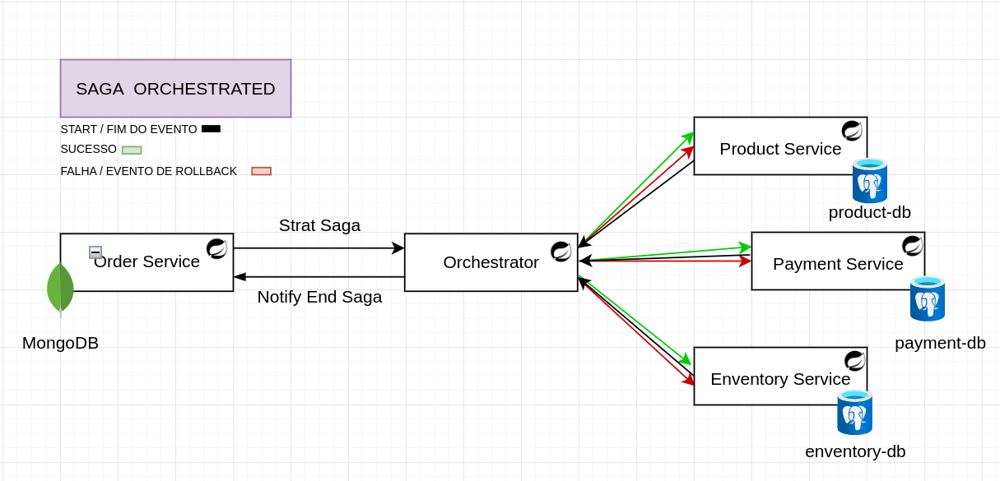

# Orchestrated-SAGA-Pattern

**ARQUITETURA**

Este repositório tem como objetivo o estudo sobre o padrão SAGA  Orquestrado.

Tudo começa através de microsserviços, que são uma solução arquitetural e organizacional do desenvolvimento de software na qual o software consiste em pequenos serviços independentes que se comunicam usando APIs.

**Solucionam**

- delimitação por domínio de negócio
- Escalabilidade e alta disponibilidade
- Entrega contínua
- Resiliência e tolerância a falhas
- baixo acoplamento

**Desafios**

- Forte necessidade de governança
- Aumento da complexidade do sistema
- Maiores pontos de falha
- Grande necessidade de métricas, observabilidade e rastreamento

**Obeservações**

É interessante cada microsserviço possuir seu **próprio banco de dados** (não é obrigatório), porém é uma boa prática, é excelente para o isolamento do serviço, porém, traz o problema para gerenciar as **transações distribuídas**.

Caso a arquitetura **não seja devidamente planejad**a, ou uma trasação distribuída não seja **devidamente tratada,** pode gerar inconsistências de dados.

## Transações Distribuídas

São transaçẽos que **iniciam em um microsserviço** e é **finalizada em outro** de maneira **conceitual**.

A trasanção não é concreta como uma transação de banco de dados, é apenas uma simbologia no fluxo de transação.  

O conceito de uma transação distribuída então é aplicada a um **contexto**, ou seja, um fluxo que é iniciado e que altera o estado dos microsseviços e que, embora não estjam na mesma transação atômica, pertencem ao mesmo contexto.

### Tow-Phase Commit Protocol - Antigo

2PC, ou Tow-Phase Commit Protocol, que é um **protocolo atômico**, ou seja, elabora uma estratégia para realizar um **commit em duas etapas em uma trasação distrubuída**. 

Geralmente ocorrerá de maneira síncrona, com requisições HTTP, essa estratégia visa iniciar o seguinte fluxo: 

- Fase 1 = realiza requisições para os serviços envolvidos para validar se o serviço tem o necessário para persistir uma informação.
- Fase 2 = realiza uma segunda requisição para cada serviço, persistindo a informação desejada.

O problema é que esse caminho, em **qualquer cenário de falha**, os **dados ficam incosistentes**.

Outro probelma é que se um dos serviços tem uma latência muito alta ou esteja inválido, isso irá gerar um atraso ou impossibilidade de continuar o fluxo. 

## Padrão Saga - Conceitos

É um padrão de projetos que tem como objetivo garantir a execução de sucesso de um fluxo de transações e também garantir que em caso de falha, todas as alterações sejam desfeitas na sequência que foram realizadas.

Existem duas implementações a **Orquestrada** e o **Coreografado**.

Benefícios do padrão Saga:

- O padrão saga demanda uma comlexidade de implementação, porém, resolve os porblemas de inconsistência de dados entre serviços.
- Não utiliza estratégia de 2PC e funciona de maneira assíncrona.

### Orquestrada

Nesta implementação um agente externo fica responsável por orquestrar, isto é, determinar qual será a ordem de envio dos eventos baseados em casos de sucesso e falha.

Nesta estratégia, apenas o orquestrador deve conhecer os serviços, além disso os serviços envolvidos devem ser totalmente independentes e não ter conhecimento algum de qual será o próximo ou anterior chamado.

**Recomendação:**

> *Utilizar quando já existe uma arquitetura de microsserviços que ainda não utiliza o padrão saga e que possua vários serviçõs implementados, pois acopla toda a lógica de orquestração em apenas um local.*
> 

O Orquestrador tem como obrigação garantir o rollback de todos os serviços em caso de uma falha.

**Vantagens**

1. Toda lógica fica centralizada, diminuindo a possibilidade de falhas em relação à orquestração dos eventos.
2. Maior testabilidade dos fluxos.
3. Os microsserviços envolvidos são totalmente independentes.
4. Recomendado para ser implementado em arquiteturas já existentes e com grandes fluxos de transações distribuídas.

### Coreografada

Seu conceito é criar uma coreografia existente entre os microsserviços, ou seja, o próprio serviço possui a lógica para saber qual será o próximo passo a ser decidido no fluxo com base no resultado da iteralção atual, seja sucesso ou falha.

Aqui os microsserviçõs tem conhecimento dos próximo serviços que serão executados.

Essa implementação é recomendad para arquitetura que está ainda em estágio inicial de desenvolvimento, evita a necessidade de manter mais um serviço de orquestração.

O próprio serviço deve garantir o próprio rollback e deve garantir que será feito o rollback.

**vantagens**

- Excelente para arquiteturas ou fluxo de transações pequenas, que nãi envolvam muitos serviços.
- É preferencial que seja impementado caso a arquitetura esteja nascendo, onde os fluxos ainda não estão definidos e envolvendo vários serviços.

**Desvantagens**

- Maior complexidade para entender e manter a lógica conforme ocorra um grande crescimento do fluxo das transações.
- Os microsseviços não são independentes, eles precisam conhecer quem vem antes ou depois no fluxo de execução.
- Pode ser mais compexo de ser testado devido o conhecimento geral dos microsserviços envolvidos.

